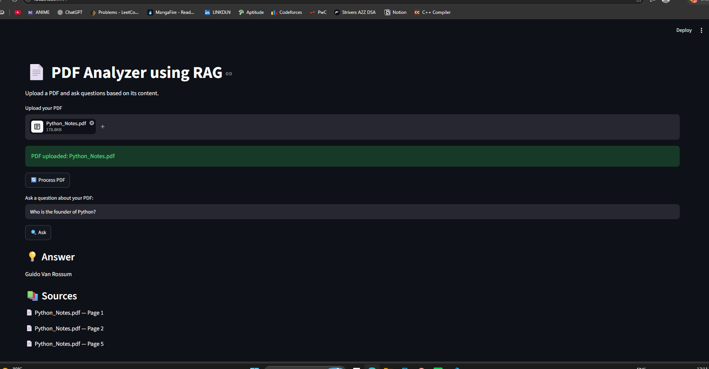

# 📄 PDF Analyzer using RAG

A simple PDF question-answering application built using Retrieval-Augmented Generation (RAG).

This project allows users to upload a PDF, process its content, and ask questions based on the information available in the PDF.

## 🎯 Project Objective

The main objective of this project is to build a system that can understand and retrieve information from PDF documents and provide answers based on the document content.

The application uses RAG instead of directly asking the language model to answer questions. This helps the system use relevant information from the uploaded PDF when generating answers.

## 🧠 How RAG Works

The application follows these steps:

PDF Upload  
↓  
PDF Text Extraction  
↓  
Text Chunking  
↓  
Text Embeddings  
↓  
FAISS Vector Database  
↓  
Similarity Search  
↓  
Relevant PDF Chunks  
↓  
Qwen LLM  
↓  
Final Answer

## ⚙️ Technologies Used

- Python
- LangChain
- PyPDFLoader
- RecursiveCharacterTextSplitter
- Ollama
- Qwen 2.5 Coder 3B
- nomic-embed-text
- FAISS
- Streamlit

## 🔍 Main Components

### 1. PDF Loading

`PyPDFLoader` is used to read the uploaded PDF and extract its text.

### 2. Text Splitting

The extracted text is divided into smaller chunks using `RecursiveCharacterTextSplitter`.

The project uses:

- Chunk size: 1000
- Chunk overlap: 200

### 3. Embeddings

The `nomic-embed-text` model converts text chunks into numerical vectors called embeddings.

These embeddings help the application find text that is semantically similar to the user's question.

### 4. FAISS

FAISS is used as the vector database.

It stores the embeddings and helps retrieve the most relevant chunks from the PDF.

### 5. Retrieval

When the user asks a question, the retriever searches the FAISS database and returns the most relevant PDF chunks.

### 6. LLM

The retrieved content is passed to the Qwen 2.5 Coder 3B model through Ollama.

The model generates an answer using the retrieved PDF context.

### 7. Streamlit

Streamlit provides the web interface where users can:

- Upload a PDF
- Process the PDF
- Ask questions
- View answers
- View source pages

## 🖥️ Application Screenshot

The application allows users to upload a PDF, ask questions, and view answers along with the source pages.



## 📁 Project Structure

```text
PDF_Analyzer _RAG/
│
├── data/
│   └── Python_Notes.pdf
│
├── src/
│   ├── loader.py
│   ├── splitter.py
│   ├── vector_store.py
│   ├── retriever.py
│   ├── rag_pipeline.py
│   └── test_embedding.py
│
├── vectorstore/
│
├── app.py
├── .gitignore
└── README.md